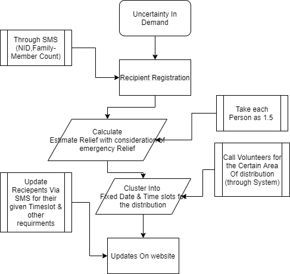

# ALMS
Advanced Relief System

We are presenting a system that focuses on corruption resistance, support count estimation, and achieving the trust of the financial supporters. 

This system will estimate the amount of relief before going there from the NID information and the family member's information provided by the receiver. So the field member will know how much relief is required for a particular area. 

As a donor, someone will be able to send his/her support on the website. The donor will be able to see the donations Directly from the Relief list by going to the site. A central authority will be controlling the full system. 

Because of its simplicity and transparency, this system will be corruption free and the donors will have trust in the system.

# Problem To Solve
Corruption resistant crystalline demonstration
A practical approach to estimate support counts and survival sufficiency requirements
Many people wants to provide financial help or food support to these vulnerable people. But due to the lack of a reliable platform they are not able to do it.

# Flowchart

#Video Demonstration (user side)
https://youtu.be/jmmCe-WeZT0
